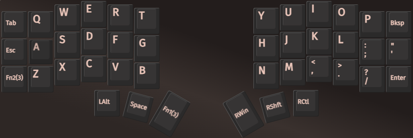
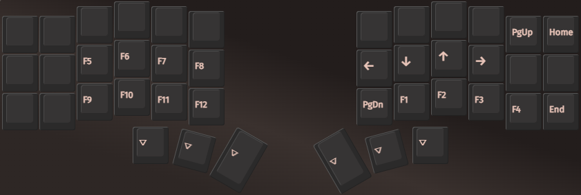
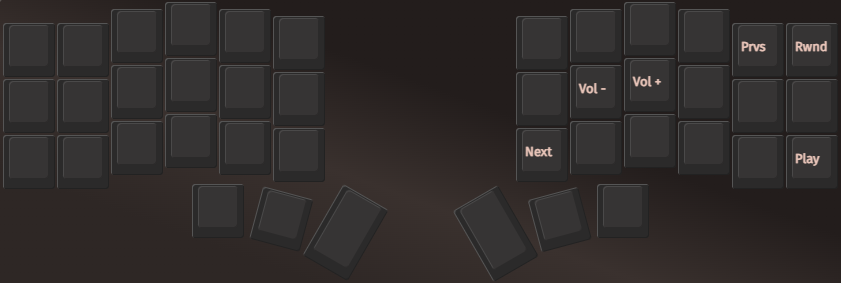

# Corne keyboard

My Corne keyboard layout.

## How to use

Run [usevia.app](https://github.com/the-via/app) and load `layout.json`. You can also use the [official site](https://usevia.app).

## Philosophy

The layout is based on the following heuristics:

- Keys should resemble the original qwerty layout to avoid muscle memory conflicts with traditional keyboards.
- Mnemonics should be used to minimize cognitive load.
- Modifier and layer keys should reside in the thumb clusters to prevent awkward key combinations.
- The most used keys for each layer should reside in the home row.
- Four layers should be more than enough.

### Layer 0

The first layer mostly resembles qwerty.

- `Space` is the only non-modifier key in the thumb cluster. As it is used all the time, it must reside in layer 0 and in a handy spot. Since the home row is taken by qwerty, this is the next logical choice.
- The external thumb keys are used to access further layers. I believe these to be a good fit considering their positions as outliers.
- On the left of `a` we have `Esc` instead of `CAPS`, a remap that many vim users also have on normal keyboards.
- I have no key for `CAPS`. If necessary, I keep `Shift` pressed while typing letters.
- Since my workflow requires me to press both `Alt` + `Shift` and `Alt` + `Ctrl`, I put `Alt` on the opposite side of the other two modifiers.
- The first layer key is positioned in the thumb cluster opposite to `Shift` as layer 1 contains keys that might require shifting.

Shortcomings:

- `Enter` is in an awkward position. However, I did not find it worth it to have `Enter` readily accessible as a thumb key like I did for `Space`. Moreover, having `Enter` as a thumb key would result in significant muscle memory conflicts against traditional keyboards. In the end, I got used to this lower-right pinky position and it currently does not bother me.
- The `Win` key, i.e. Mac's `Cmd` key, is in an awkward position when it comes to pressing it in combination with `Tab`. While not currently a problem with Windows, I might reconsider its position if I ever use a Mac in the future.
- Since no more space is left in the thumb clusters, the second layer key is positioned on the bottom left and must reached with the left pinky. This reduces mobility of the other left fingers.

### Layer 1

The second layer is for numbers and symbols. You can access it by pressing the left external thumb key.

- Numbers in the home row are very handy and I prefer them to having them at the top row like I have seen in some layouts.
- You can easily press `Shift` with your right thumb to access all the available symbols.
- `[` and `]` are just above `(` and `)`.
- Pass-through still gives you access to useful keys like `Enter` and number-related symbols like `.`.
- `\` is positioned opposite to `/`.

Shortcomings:

- `;` is the only symbol key not accessible in this layer, as it is shadowed by `0`. I thought of positioning `0` somewhere else, but unfortunately that would make `(` and `)` no longer near eachother.
- The position of `-` and `=` does not really match the original qwerty layout.

### Layer 2

The third layer is for navigation and function keys. You can access it by pressing the bottom left pinky key.

- The arrow keys are positioned to resemble vim arrow keys.
- Since it is unlikely for symbols to be useful in this layer, we do not pass through those.
- `Home` and `End` mirror the behavior of the shadowed `Backspace` and `Enter`.
- `PgDown` and `PgUp` are positioned to resemble vim's `n` and `p`.
- Since the left pinky is already being used to access the layer, we position the most used function keys (1 to 4) on the right side of the keyboard for ease of access.

Shortcomings:

- The position of the function keys is not as straightforward as that of numbers.
- Function keys from 5 onwards are awkward to type, as the left pinky is already pressing on the bottom-left key to access the layer. This is why they start from the ring finger and we avoid positioning them in the top row.

### Layer 3

The fourth layer is for media control. You can access it by pressing both layer keys.

- `Vol-` and `Vol+` are positioned to resemble vim arrow keys.
- `Next` and `Prev` are positioned to resemble vim's `n` and `p`.
- `Rewind` and `Play` mirror the behavior of the shadowed `Backspace` and `Enter`.
